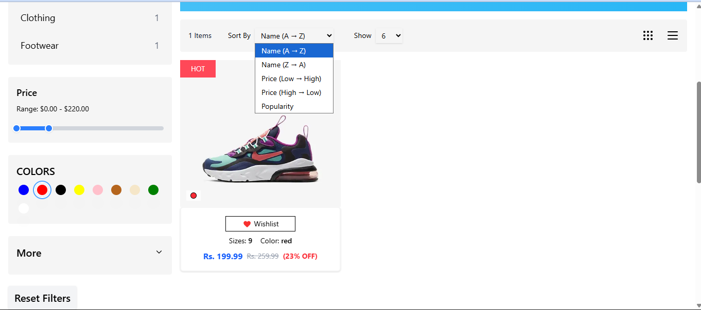

# Product Listing Page

Built a Fully Responsive Product Listing page with sorting , filtering based on color and popularity etc.Used reusable components .Please go the below link and check it out...😃

## Live Demo
[View Demo](https://e-shop-olive-one.vercel.app/)

## Screenshots

### Desktop View


### Mobile View


### Desktop Filter Functionality


### Mobile Filter Functionality


### More Samples


## About This Project

This is my submission for the Frontend Developer Internship test at SoftDef. I recreated the product listing page exactly as shown in the Figma design with all the required features.

## What I Built

- Product listing with filters and sorting
- Responsive design (works on mobile, tablet, desktop)
- Color selection that changes product card background
- Working pagination
- Expandable sidebar categories
- Search and filter functionality

## Tech Stack

- React.js (JavaScript)
- Tailwind CSS
- Lucide React (for icons)
- ImageKit (for product images)
- Mock data (24+ products)

## How to Run

1. Clone this repo:
```bash
git clone [YOUR_REPO_URL]
cd [PROJECT_NAME]
```

2. Install dependencies:
```bash
npm install
```

3. Start the project:
```bash
npm run dev
```

4. Open http://localhost:5173 in your browser

## Features I Implemented

- **Reusable Components**: Navbar, Sidebar, ProductCard, Pagination, etc.
- **Filters**: Category filters that expand/collapse + color selection
- **Sorting**: By name, price, and popularity
- **Responsive**: Works on all screen sizes
- **Accessibility**: Keyboard navigation and proper focus states
- **Mock Data**: Created 24+ products with all required fields

## Important Notes

- No AI tools were used (as per assignment requirements)
- Pixel-perfect match with the Figma design
- All features are fully functional
- Tested on different screen sizes

## Contact

Built by [RAUNAK KUMAR]  
Email: [kumarraunak085@gmail.com]